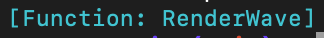

# r-r-w

Latest in NPM is _not_ the latest in the GitHub so I cloned from [GitHub](https://github.com/dev-intj/react-render-wave) then used `npm link`:

```bash
git clone https://github.com/dev-intj/react-render-wave.git
cd react-render-wave
npm i
npm link
```

In `r-r-w` I used the _linked_ package:

```bash
cd r-r-w
npm link react-render-wave
```

(There's documentation for [`npm link`](https://docs.npmjs.com/cli/v8/commands/npm-link) at NPMJS which you'll need to look at if you're not familiar with it)

The main problems seem to be:

1. TSC is generating JS files in `dist` where _local imports_ do not have a `.js` extension
2. Some of the imports into JS of the WASM files disagree with the exports (see `dist/pkg/react_render_wave_wasm.js`)
3. Change `import initWasmModule from "./pkg/react_render_wave_wasm_bg.wasm?url";` to `import * as initWasmModule from "./pkg/react_render_wave_wasm_bg.wasm?url";`

Presumably these are somehow just a build issue that Vite takes care of for the Storybooks

(Diff the `dist` directory in _this_ repository against your own for `react-render-wave` to see my changes)

Note also:

- Node wants to have the `--experimental-wasm-modules` flag in my environment (I'm currently running `v23.11.0`)

Again (and as you're aware) that wasn't an issue for the Storybooks! So Storybooks is doing everything right

## CommonJS

Node errors with "_WASM is currently unsupported by require_" for _CommonJS_ but I'm only really interested in getting the JS to export the `RenderWave` component

I went into the `dist` folder and removed the imports of the WASM code just to prove that the rest will compile, which it did. (I put the WASM stuff back for the same test in _ModuleJS_)

```bash
cd r-r-w
node --experimental-wasm-modules index.cjs
```

### ModuleJS

```bash
cd r-r-w
node --experimental-wasm-modules index.mjs
```

Provided you can see something in your terminal representing the exported function _Node is happy_:


